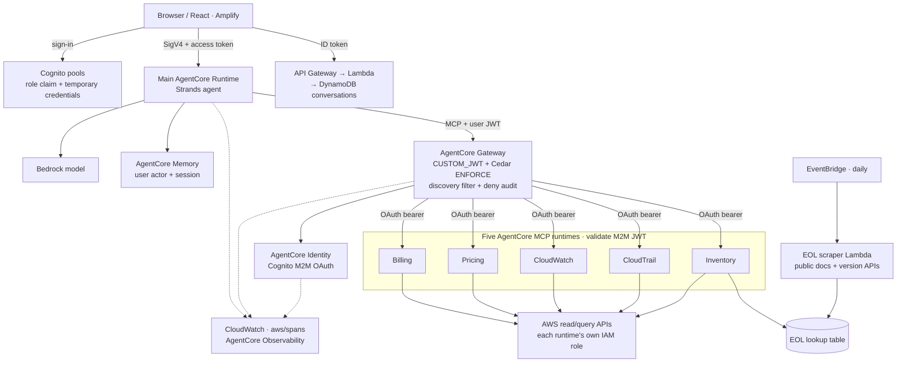
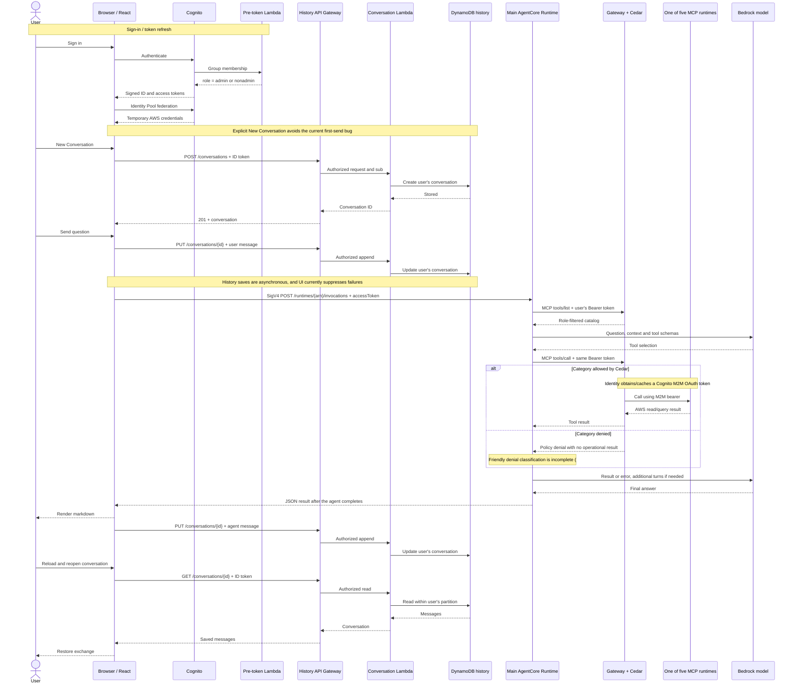
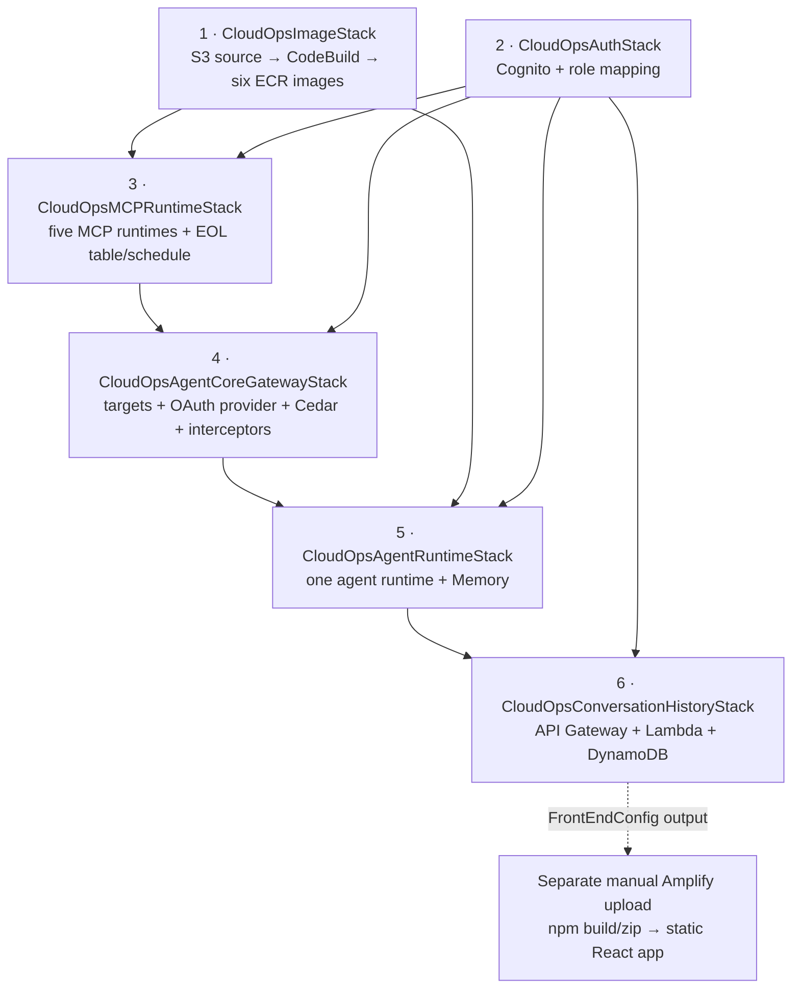

# CloudOps reference architecture

[← README](README.md) · [Getting started](README.md#getting-started) · [Security & limitations](README.md#security--limitations)

This document describes the implementation merged in [`c5c0d5c`](https://github.com/aws-samples/sample-cloudops-agent-amazon-bedrock-agentcore/commit/c5c0d5c). It is a learning/reference stack, not a production architecture certification. Deployment and first-use commands live only in the [README](README.md#getting-started).

## Component and source map

| Component | Purpose | Reusable pattern | Source |
| --- | --- | --- | --- |
| CDK application | Assemble the six backend stacks and pass their outputs | Explicit dependencies and one model configuration propagated to code and IAM | [`cdk/bin/app.ts`](cdk/bin/app.ts) |
| ImageStack | Upload source, build six ARM64 containers and push to ECR | Build upstream MCP servers from a tested source revision; adapt stdio servers to streamable HTTP | [`image-stack.ts`](cdk/lib/image-stack.ts), [`codebuild-scripts/`](codebuild-scripts/) |
| AuthStack | Cognito User/Identity Pools, frontend and M2M clients, bootstrap admin | Derive signed role claims from group membership; obtain short-lived frontend AWS credentials | [`auth-stack.ts`](cdk/lib/auth-stack.ts), [`pre-token-generation/`](cdk/lambda/pre-token-generation/) |
| MCPRuntimeStack | Host Billing, Pricing, CloudWatch, CloudTrail and Inventory independently | Separate runtime roles and JWT-protected tool endpoints | [`mcp-runtime-stack.ts`](cdk/lib/mcp-runtime-stack.ts) |
| AgentCoreGatewayStack | Central MCP discovery and invocation | Validate user JWTs, enforce target-category Cedar policies, filter discovery, exchange outbound OAuth credentials, and audit denies | [`gateway-stack.ts`](cdk/lib/gateway-stack.ts) |
| AgentRuntimeStack | Host the main Strands agent and AgentCore Memory | Managed agent execution with per-user memory actors and a configurable Bedrock model | [`agent-runtime-stack.ts`](cdk/lib/agent-runtime-stack.ts) |
| Agent entry point | Resolve caller context, discover permitted tools, invoke the model and return the final result | Per-request MCP client/catalog rather than shared privileged tools | [`agentcore/agent_runtime.py`](agentcore/agent_runtime.py), [`streamable_http_bearer.py`](agentcore/streamable_http_bearer.py) |
| ConversationHistoryStack | Persist browser conversations in DynamoDB via REST API | Authorizer-verified subject used for per-user storage keys | [`conversation-history-stack.ts`](cdk/lib/conversation-history-stack.ts), [`handler.py`](cdk/lambda/conversations/handler.py) |
| React frontend | Configure, sign in, chat, and reopen history | Separate signed agent invocation from JWT-authenticated history requests | [`App.tsx`](frontend/src/App.tsx), [`agentCore.ts`](frontend/src/services/agentCore.ts), [`conversationService.ts`](frontend/src/services/conversationService.ts) |
| Inventory MCP source | Query versions and enrich inventory with EOL dates | Read-only AWS discovery with a cached lookup table | [`mcp-servers/inventory/`](mcp-servers/inventory/), [`tools/`](mcp-servers/inventory/src/inventory_mcp_server/tools/) |
| EOL scraper | Refresh public/API lifecycle data daily | Scheduled enrichment separated from interactive requests | [`eol-scraper/`](mcp-servers/inventory/eol-scraper/), wired in MCPRuntimeStack |
| Observability | Export agent/model/tool metadata and native service traces | Allowlist telemetry before export; attach session context to model usage spans | [`observability.py`](agentcore/observability.py), [`observability.ts`](cdk/lib/observability.ts), [`telemetry regression`](agentcore/tests/test_observability.py) |

`inventory-mcp-agentcore/` is a standalone copy, not ImageStack's Inventory build source. Use `mcp-servers/inventory/` when extending this deployment.

## Runtime and data paths

**Reading the diagram:** solid arrows are runtime/API/data access; dashed arrows are telemetry. The five MCP runtimes also emit native service traces. The schedule is independent of a chat turn. None of the browser's history calls go directly to DynamoDB.

### Agent memory is not UI history

| Store | Key / access path | Used for |
| --- | --- | --- |
| AgentCore Memory | Runtime session manager; actor derived from the forwarded Cognito subject, not payload `userId` | Agent context across turns. The stack configures 30-day event expiration; no long-term extraction strategy is configured. |
| DynamoDB conversations | API Gateway → Lambda; `userId` partition key from the authorizer's `sub`, `conversationId` sort key | Browser conversation metadata and displayed messages across reloads/devices. |
| DynamoDB EOL schedules | Scraper writes; Inventory runtime reads | Version support-date enrichment, not conversation memory. |

The request's MCP discovery succeeds through the JWT-validating Gateway before the runtime configures the Memory session manager. The runtime itself **decodes**, rather than cryptographically verifies, the payload JWT's subject; do not generalize this sample into a standalone JWT verifier or an arbitrary multi-tenant security boundary. Review the full chain before changing the auth path.

## Request sequence

Cognito invokes the pre-token trigger at **issuance/refresh**, not on every tool request. Group changes therefore require new tokens. The agent can perform multiple model/tool cycles. Reading the HTTP response body as a stream does not make the UI token-streaming: `invokeAgent()` parses the completed JSON before rendering. Browser abort/timeout does not establish server-side execution cancellation.

## Trust boundaries

| Boundary | Authentication / authorization | Important limit |
| --- | --- | --- |
| Browser → Cognito | User Pool login; trigger adds `role` to ID/access tokens based on `Administrators` membership | A custom `role` field in a request is not authority. Protect Cognito administration and refresh tokens after role changes. |
| Browser → main Runtime | Identity Pool temporary credentials sign SigV4. Authenticated role is scoped to the main runtime; unauthenticated identities are disabled. User access JWT also travels in the request body. | Never log the complete invocation payload. This JWT is separate from the IAM transport credential. |
| Browser → history API | Cognito ID token validated by API Gateway; Lambda keys data using authorizer `sub` | Browser has no direct DynamoDB access. See actual CRUD routes below. |
| Runtime → Gateway | `Authorization: Bearer <user access JWT>`; `CUSTOM_JWT` validates issuer, signature and allowed frontend client ID | Missing/invalid JWTs fail authentication. The legacy tokenless SigV4 fallback does **not** make this CUSTOM_JWT Gateway grant billing access. |
| Gateway → MCP runtime | AgentCore Identity OAuth provider exchanges Cognito M2M client credentials; runtimes allow that M2M client | Client-credentials/M2M, not delegated end-user OAuth. A client secret exists in the managed credential path; do not claim every credential is short-lived. |
| MCP runtime → AWS | Each runtime's execution role supplies temporary credentials for permitted AWS APIs | Read/query permissions are still sensitive; several APIs require account-wide resource wildcards. No remediation/trail-management permission is intended. |

### Policy, discovery and audit

| Role | Assignment | Permitted target categories |
| --- | --- | --- |
| Admin | Cognito `Administrators` group | Billing, Pricing, CloudWatch, CloudTrail, Inventory |
| Non-admin | Authenticated user outside that group | Billing, Pricing |

The Policy engine runs in **`ENFORCE`**, with two Cedar permits over Gateway **target action groups**, such as `AgentCore::Action::"cloudwatchMcp"`. There is no permit for unknown target categories. The target role's IAM permissions remain a separate downstream boundary.

- The **RESPONSE interceptor** filters `tools/list` using the role/category model and returns an empty catalog on filtering errors. **Semantic-search results can still name inaccessible tools**; discovery-name exposure is not permission to execute them.
- **Cedar authorizes invocation** independently of the model's decisions or discovery filtering. A denied call returns no operational result. The runtime's denial classifier does not recognize every current Gateway error shape; do not depend on one friendly phrase.
- The **REQUEST interceptor is audit-only**. It computes the expected deny using the same category model, logs `{identityRef, category, outcome, timestamp}`, and always passes the request through. Cedar remains authoritative even if audit logging fails. Native policy spans complement, not replace, this record.
- Category mappings are vendored into the self-contained interceptor Lambda assets. Keep them aligned with [`agentcore/authorization_model.py`](agentcore/authorization_model.py) when extending targets. Tests are in [`agentcore/tests/`](agentcore/tests/) and [`cdk/test/`](cdk/test/).

### Conversation API

All data methods use a Cognito authorizer; `OPTIONS` supports CORS preflight.

| Route | Behavior |
| --- | --- |
| `GET /conversations` | List the authenticated user's conversations |
| `POST /conversations` | Create a conversation |
| `GET /conversations/{id}` | Read metadata and messages |
| `PUT /conversations/{id}` | Append messages and/or rename |
| `DELETE /conversations/{id}` | Delete that user's conversation |

The frontend suppresses some append failures. Explicit **New Conversation** and the configured history endpoint are necessary workarounds until [#19](https://github.com/aws-samples/sample-cloudops-agent-amazon-bedrock-agentcore/issues/19) and [#20](https://github.com/aws-samples/sample-cloudops-agent-amazon-bedrock-agentcore/issues/20) are resolved.

## Deployment topology

1. **ImageStack** uploads the local agent, Inventory source and upstream patch scripts to S3. CodeBuild builds ARM64 images and pushes to six ECR repositories. Four MCP images fetch the SHA in `mcp-source.conf`; Inventory and the main agent use this repository. MCP build-waiter custom resources gate stack completion, but the **main-agent build is triggered without a waiter**. The README's staged deployment explicitly checks it before creating/updating runtimes.
2. **AuthStack** creates User/Identity Pools, the frontend client, the client-credentials M2M client, the role trigger/group, IAM roles and the emailed bootstrap admin. Access-token customization uses Cognito's Essentials plan.
3. **MCPRuntimeStack** creates five public-network runtimes, their read/query policies, JWT authorizers, the optional EOL table and scheduled scraper.
4. **GatewayStack** registers those runtime endpoints, manages the OAuth provider and Cedar policies through custom resources, and wires REQUEST/RESPONSE interceptors. It also configures native trace deliveries for the Gateway, MCP runtimes and associated identities/provider.
5. **AgentRuntimeStack** points the main agent at Gateway, configures its model and Memory, and adds runtime/Memory/workload-identity tracing. Runtime environment changes select a new runtime version; use a fresh session when checking updates.
6. **ConversationHistoryStack** publishes `FrontEndConfig`, assembled from the authentication, runtime and history outputs. It does not inject that configuration into the frontend bundle.

Builds fetch public source/packages and require network access. Upstream source is pinned; not every transitive package or container base is frozen. The patch check verifies HTTP discovery in Linux but does not establish cloud permissions. Generated `.js` files accompany the TypeScript because `cdk.json` runs `node bin/app.js`; compile after editing TypeScript.

## EOL enrichment

The interactive Inventory server never scrapes documentation. It reads a cached support-date lookup from DynamoDB, refreshed by the daily scraper:

| Service family | Source | Caveat |
| --- | --- | --- |
| EKS | `DescribeClusterVersions` API | Available versions/dates depend on API response and Region |
| RDS / Aurora | Public AWS release calendars and version documentation | HTML changes can break extraction |
| ElastiCache | Public engine documentation plus version APIs | Unknown/unannounced support dates remain unknown |
| OpenSearch | Public documentation and version APIs | Version ranges require mapping to concrete versions |
| MSK | Public Kafka support documentation plus version APIs | Extended support is not assumed |

The [verification module](mcp-servers/inventory/eol-scraper/eol_scraper/verification.py) checks date format/plausibility, chronology, coverage and conflicts. It **warns and continues**, with invalid dates normalized to `Unknown`; `N/A` is distinct from unknown. The writer deduplicates `(service, version)` before batch writing. This is not content authentication, and neither a successful Lambda transport status nor a table row proves a date is authoritative. Check the handler summary and stored data as described in [Getting started](README.md#4-populate-and-check-the-eol-data).

## Observability

Three different evidence types matter:

1. **Built-in service metrics** in `AWS/Bedrock-AgentCore`: runtime calls/latency, policy allows/denies, and Identity token-fetch success. These can exist without agent instrumentation.
2. **Runtime stdout and canonical deny-audit logs**: useful operational evidence but not model execution traces.
3. **Instrumented agent/model/tool spans and native service spans**: exported to the shared `aws/spans` destination and queried by AgentCore Observability for sessions, traces and model-token totals.

The main agent owns one filtered `OTLPAwsSpanExporter`. It instruments Starlette, HTTPX and botocore alongside Strands, derives resource attribution from the platform's runtime URL, propagates X-Ray/W3C context and attaches the runtime session ID to child spans before the asynchronous export thread runs. Model **CLIENT** spans carry input/output counts; summing those avoids counting both model calls and Strands aggregate spans. A tool-only span has no inference usage to count.

The exporter drops non-allowlisted attributes, span events, links and exception descriptions **before** ADOT can extract content into logs. It preserves model/tool names, session/trace IDs, timing, status and usage. The normal Strands response-printing callback is disabled. These controls do not sanitize arbitrary future application log statements; test new integrations and restrict log readers.

The CDK helpers create **16 native `TRACES` deliveries**, serialized within each stack to avoid CloudWatch provisioning conflicts: six runtimes, one Gateway, one Memory, seven workload identities and one OAuth provider. They do not enable default `APPLICATION_LOGS`, which can contain invocation tokens and tool bodies. They do not modify account-wide Transaction Search, sampling or shared retention policies. The main runtime opts out of the newer unified per-agent span destination to avoid additional log-resource-policy permissions.

Known limits:

- Token usage is retained, but prompts, completions and detailed tool errors are intentionally absent. Content-based evaluation cannot use these metadata-only traces.
- OAuth resource-token fetch spans can have separate service-generated trace IDs; workload-token operations were observed within request traces. Do not infer complete cross-service correlation merely from nonempty logs.
- MCP server internals are not auto-instrumented. Native runtime spans plus agent tool spans cover the call boundary.
- The generic console trace drawer can show `Agent: -` or different badge/tree span counts even with correct endpoint metadata and usage. Verify the underlying session/model spans, not just a badge.
- Shared traces contain operational identifiers, incur ingestion/storage/query costs, and may outlive the sample's stacks. Account owners control access and retention.

## Architectural trade-offs and production work

- **Public networking:** no private-egress boundary. CloudWatch/CloudTrail/Inventory may use private service access in a hardened design, but verify endpoint support for every API. Several cost/pricing operations and public scraping need controlled public egress or redesign.
- **One educational deployment:** fixed resource names and one Cognito domain/role model simplify the sample. They are not a ready-made multi-account tenancy, deployment promotion or cross-account authorization design.
- **Read/query operations:** useful for inspection; not an automated remediation framework. IAM permissions, tool arguments, prompt injection and data exfiltration all require review before adding write capabilities.
- **Independent history and execution:** a successful agent answer does not prove its history saved. Browser cancellation does not guarantee backend cancellation. See the README workarounds and open issues.
- **Payload-free telemetry:** reduces exposure but removes content needed for some debugging/evaluation. Do not turn on raw capture to compensate without a data-handling and redaction design.
- **Sample defaults:** CORS, public endpoints, broad read-resource scopes, dependency pinning, backups, retention, quotas, alarms and failure recovery need workload-specific hardening. CDK-Nag suppressions document exceptions, not certification.

Return to [Getting started](README.md#getting-started), [verification](README.md#verification-and-troubleshooting), or [cleanup](README.md#cleanup).
