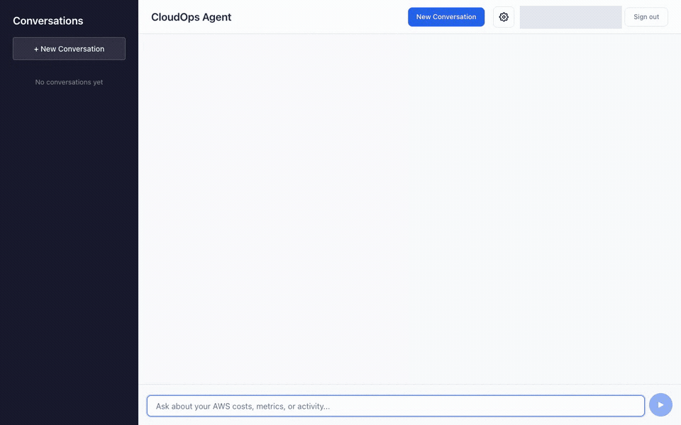
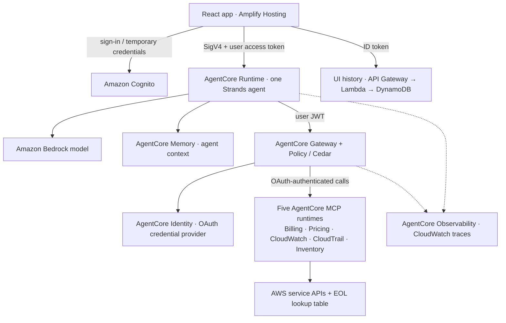
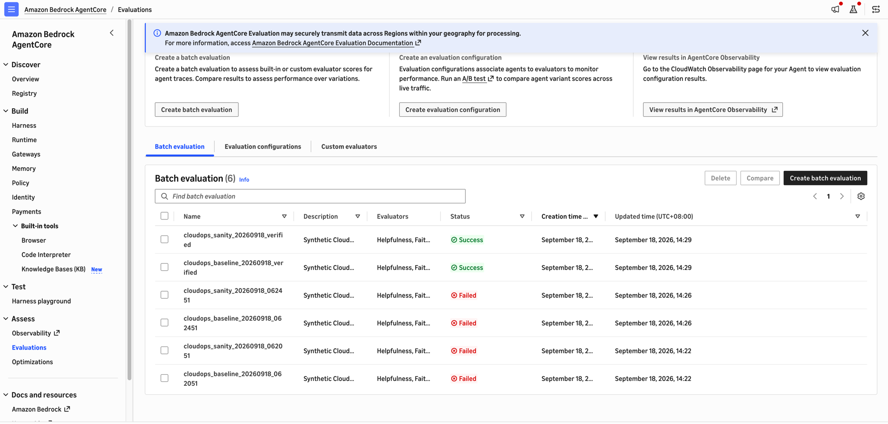

# CloudOps agent on Amazon Bedrock AgentCore

Build and deploy a CloudOps agent on Amazon Bedrock AgentCore. This AWS sample brings together managed agent hosting, MCP tools, identity propagation, policy-enforced tool access, session memory, and metadata-only observability in six AWS CDK stacks—with a React app for exploring cost, monitoring, audit, and inventory questions.

[](LICENSE)
[](https://aws.amazon.com/bedrock/agentcore/)
[](https://aws.amazon.com/cdk/)

For cloud engineers, platform teams, and developers learning to connect an agent to AWS operations. The badges identify technology and licensing, not certification or a passing test suite.

> **Educational reference implementation—not production-ready infrastructure or an AWS Support service.** Review permissions, costs, data handling, and [limitations](#security--limitations) before deploying.

**[Demo](#demo) · [Architecture](#architecture) · [Getting started](#getting-started) · [Extend](#extend-this-sample) · [Security & limitations](#security--limitations) · [Cleanup](#cleanup)**

## Demo

[](docs/media/cloudops-demo.png)

**New Conversation → alarm check → answer → reload and reopen.** Recorded against the deployed implementation from [`c5c0d5c`](https://github.com/aws-samples/sample-cloudops-agent-amazon-bedrock-agentcore/commit/c5c0d5c) in an authorized demo account. The model and tool responses are real; the username is masked and waiting time is shortened. [View the static screenshot](docs/media/cloudops-demo.png). Deploy your own copy; this repository does not provide a public hosted service.

Three useful starting points:

| Outcome | Example question | Role |
| --- | --- | --- |
| Understand cost | “Which AWS services contributed most to my costs last month?” | Admin or non-admin |
| Investigate operations | “Use CloudWatch to check active alarms in this Region.” Follow with an audit-event lookup. | Admin |
| Plan version upgrades | “List my RDS instances and their end-of-support dates.” | Admin; EOL data must be populated |

Answers depend on account data, enabled services, IAM permissions, and the selected model. An empty alarm or inventory result can be correct.

## Architecture



This is **one CloudOps agent with five MCP tool servers**, not a multi-agent system. The agent uses Gateway for tool discovery and invocation; **Cedar policy**, not the prompt, determines which categories the caller may invoke. The five MCP runtimes use their own AWS execution roles. **AgentCore Memory** maintains agent context; the separate **DynamoDB conversation API** restores the browser's conversation list and messages.

CDK/CodeBuild/ECR build and provision the backend; they are not on the chat request path. Amplify hosting is a separate manual deployment. A daily EventBridge-triggered scraper refreshes the EOL lookup table.

**[Read ARCHITECTURE.md](ARCHITECTURE.md)** for detailed diagrams, request sequencing, trust boundaries, the six-stack deployment topology, component/source links, and architectural trade-offs.

## Getting started

### 1. Prerequisites and costs

Use a **disposable AWS account** and a Region supporting the AgentCore capabilities and Bedrock model you choose. The implementation was exercised in `us-east-1`; that does not establish support in every Region. Check [AgentCore Region availability](https://docs.aws.amazon.com/bedrock-agentcore/latest/devguide/agentcore-regions.html) and [Bedrock model availability](https://docs.aws.amazon.com/bedrock/latest/userguide/models-regions.html).

Install:

- **Node.js 22 LTS** and npm; documentation/build checks use Node **22.18.0**. See [CDK-supported Node versions](https://docs.aws.amazon.com/cdk/v2/guide/node-versions.html).
- Git, [AWS CLI v2](https://docs.aws.amazon.com/cli/latest/userguide/getting-started-install.html), and [uv](https://docs.astral.sh/uv/getting-started/installation/). Python test environments are managed with uv; the deployed main image uses Python 3.14.
- Docker running for Lambda asset bundling and the optional MCP patch check; `zip` for the frontend upload archive. Commands below use a Bash-compatible shell. CDK is installed by `npm ci`; no global CDK install is required.
- An AWS profile authorized to bootstrap CDK and provision this sample: CloudFormation, IAM roles/policies and `iam:PassRole`, S3/ECR/CodeBuild, Cognito, Lambda, DynamoDB, API Gateway, EventBridge, AgentCore and CloudWatch delivery resources. Organization SCPs, permission boundaries and service quotas also apply. Have your account administrator review the [CDK bootstrap permissions](https://docs.aws.amazon.com/cdk/v2/guide/bootstrapping-env.html); runtime read permissions are not deployment permissions.
- Account access to the chosen Bedrock model, including any provider/Marketplace prerequisites and cross-Region inference permissions. See [model access](https://docs.aws.amazon.com/bedrock/latest/userguide/model-access.html).
- **CloudWatch Transaction Search enabled once per account/Region**, with its X-Ray log resource policy. Follow [AWS's setup procedure](https://docs.aws.amazon.com/bedrock-agentcore/latest/devguide/observability-configure.html). This sample configures resource trace deliveries, not account-wide enablement.

**Deployment and queries incur charges.** Budget for [Bedrock inference](https://aws.amazon.com/bedrock/pricing/), [AgentCore Runtime/Gateway/Policy/Memory](https://aws.amazon.com/bedrock/agentcore/pricing/), [CodeBuild](https://aws.amazon.com/codebuild/pricing/), [ECR](https://aws.amazon.com/ecr/pricing/) and [S3](https://aws.amazon.com/s3/pricing/), [Cognito](https://aws.amazon.com/cognito/pricing/), [Amplify hosting](https://aws.amazon.com/amplify/pricing/), [DynamoDB](https://aws.amazon.com/dynamodb/pricing/), [API Gateway](https://aws.amazon.com/api-gateway/pricing/), [Lambda](https://aws.amazon.com/lambda/pricing/), and [CloudWatch logs/traces](https://aws.amazon.com/cloudwatch/pricing/). Tool calls such as Cost Explorer and Logs Insights can also cost money. Tool catalogs and multiple model turns can make even a short question expensive. No free-tier or fixed-cost assumption is made here; clean up when finished.

### 2. Clone and select the environment

```bash
git clone https://github.com/aws-samples/sample-cloudops-agent-amazon-bedrock-agentcore.git
cd sample-cloudops-agent-amazon-bedrock-agentcore
git rev-parse HEAD  # Record the revision you actually test.

export AWS_PROFILE="<your-demo-profile>"
export AWS_REGION="<your-region>"
export AWS_DEFAULT_REGION="$AWS_REGION"
export COGNITO_ADMIN_EMAIL="<your-email-address>"

aws sts get-caller-identity  # Stop if this is not your intended account.
aws xray get-trace-segment-destination --region "$AWS_REGION"
# Require Destination=CloudWatchLogs and Status=ACTIVE before proceeding.
```

The default model is `us.anthropic.claude-sonnet-4-5-20250929-v1:0`. If that profile is not available from your chosen Region, set `BEDROCK_MODEL_ID` to a compatible model or inference-profile ID **before synthesis**. This value controls both the runtime model and its IAM model-resource permissions.

The sample uses fixed names for several resources. Do not deploy a second copy into the same account/Region without addressing name collisions. If reusing an EOL table, set `EOL_TABLE_NAME` to that table's name before synthesis; the scraper will write to it.

### 3. Bootstrap, build, and deploy the backend

```bash
cd cdk
npm ci
npm run build
ACCOUNT_ID=$(aws sts get-caller-identity --query Account --output text)
npx cdk bootstrap "aws://$ACCOUNT_ID/$AWS_REGION"
npx cdk synth --quiet

# Keep this synthesized assembly for both deployment stages.
npx cdk deploy --app cdk.out CloudOpsImageStack CloudOpsAuthStack --exclusively
```

Review CDK's security-change prompts before approving. **Do not proceed until the main image build has succeeded.** ImageStack waits for the MCP builds but only triggers the main-agent build; stack completion alone does not prove that its new image is available. In CodeBuild, inspect `cloudops-mainruntime-build`, or run:

```bash
MAIN_BUILD_ID=$(aws codebuild list-builds-for-project \
  --project-name cloudops-mainruntime-build --sort-order DESCENDING \
  --query 'ids[0]' --output text)
aws codebuild batch-get-builds --ids "$MAIN_BUILD_ID" \
  --query 'builds[0].{Status:buildStatus,Started:startTime,Logs:logs.deepLink}'
# If IN_PROGRESS, wait and repeat batch-get-builds for this same ID.
# Continue only on SUCCEEDED; investigate FAILED/FAULT/STOPPED/TIMED_OUT.

npx cdk deploy --app cdk.out --all
cd ..
```

Using the same assembly avoids regenerating build-trigger timestamps between stages. The backend comprises the [six stacks](ARCHITECTURE.md#deployment-topology); CDK does **not** deploy the React frontend. Check CloudFormation completion and AgentCore runtime/Gateway readiness before first use. A healthy stack is configuration evidence, not a substitute for the smoke checks below.

### 4. Populate and check the EOL data

The daily refresh has not necessarily run on a new deployment. Retrieve its function name from the stack output and invoke it once:

```bash
EOL_FUNCTION=$(aws cloudformation describe-stacks \
  --stack-name CloudOpsMCPRuntimeStack \
  --query "Stacks[0].Outputs[?OutputKey=='EolScraperFunctionName'].OutputValue | [0]" \
  --output text)
VERIFY_DIR=$(mktemp -d)
aws lambda invoke --function-name "$EOL_FUNCTION" \
  "$VERIFY_DIR/eol-result.json" > "$VERIFY_DIR/eol-invoke.json"

uv run python - "$VERIFY_DIR" <<'PY'
import json, sys
from pathlib import Path
root = Path(sys.argv[1])
meta = json.loads((root / 'eol-invoke.json').read_text())
result = json.loads((root / 'eol-result.json').read_text())
assert 'FunctionError' not in meta, meta
assert result.get('unique_records', 0) > 0, result
assert all(result.get('by_service', {}).get(s, 0) > 0
           for s in ('eks', 'rds', 'elasticache', 'opensearch', 'msk')), result
print(json.dumps(result, indent=2))
PY

EOL_TABLE=$(aws lambda get-function-configuration --function-name "$EOL_FUNCTION" \
  --query 'Environment.Variables.EOL_TABLE_NAME' --output text)
aws dynamodb scan --table-name "$EOL_TABLE" --select COUNT \
  --query '{Count:Count,ScannedCount:ScannedCount}'
```

Require a nonzero table count as well as the function's per-service results. `StatusCode: 200` alone only means Lambda accepted/completed the invocation protocol; check `FunctionError`, the response body, data and logs. Zero coverage for a service needs investigation. Dates can still be `Unknown`; scraping and date checks do not prove source correctness.

### 5. Publish the frontend and configure it

```bash
cd frontend
npm ci
npm run zip  # Builds and creates cloudops-frontend.zip.
cd ..

aws cloudformation describe-stacks --stack-name CloudOpsConversationHistoryStack \
  --query "Stacks[0].Outputs[?OutputKey=='FrontEndConfig'].OutputValue | [0]" \
  --output text
```

In **AWS Amplify Hosting**, create an app using **Deploy without Git** and upload `frontend/cloudops-frontend.zip`. Follow [Amplify's manual deployment guide](https://docs.aws.amazon.com/amplify/latest/userguide/manual-deploys.html). Open your app's URL after deployment succeeds. Do not publish your account's URL or configuration as demo evidence.

The setup screen has **individual fields, not a JSON import**. Copy each value from `FrontEndConfig` into these controls:

| Output field | Setup control |
| --- | --- |
| `cognito.userPoolId` | Amazon Cognito → User Pool ID |
| `cognito.userPoolClientId` | Amazon Cognito → User Pool Client ID |
| `cognito.identityPoolId` | Amazon Cognito → Identity Pool ID |
| `cognito.region` | Amazon Cognito → Region |
| `agentcore.agentArn` | AgentCore → AgentCore Runtime ARN |
| `agentcore.region` | AgentCore → Region |
| Optional display label, e.g. `CloudOps Agent` | AgentCore → Agent Name |
| **`conversationApi.endpoint`** | **Conversation History API → API Endpoint URL** |

Click **Save**; the page reloads. Settings are stored in this browser's `localStorage`, so another browser needs its own setup. The history endpoint currently looks optional but is required for the sidebar ([#20](https://github.com/aws-samples/sample-cloudops-agent-amazon-bedrock-agentcore/issues/20)).

### 6. Sign in and send the first query

1. Sign in as **`admin`**, using the temporary password emailed to `COGNITO_ADMIN_EMAIL`. Change it when prompted. The bootstrap user belongs to the Cognito `Administrators` group.
2. **Click New Conversation before sending.** The current first-send path otherwise fails to save history ([#19](https://github.com/aws-samples/sample-cloudops-agent-amazon-bedrock-agentcore/issues/19)).
3. Send: **“Use CloudWatch to check active alarms in this Region and summarize in one sentence.”** Include your chosen Region if different from the tool default. Expect an alarm summary or a valid empty result—not a permissions/configuration error.
4. Wait for the final answer, then reload and reopen the conversation from the sidebar. Both your question and the answer should return.
5. For the non-admin path, create a separate Cognito user outside `Administrators`. A pricing question is allowed; operational CloudWatch/CloudTrail/Inventory calls are denied. Exact friendly denial wording is not guaranteed ([#18](https://github.com/aws-samples/sample-cloudops-agent-amazon-bedrock-agentcore/issues/18)).

The UI renders the **final JSON result**, not token-by-token model output. **Stop** cancels the browser's request; it does not guarantee cancellation of backend execution or charges.

## Extend this sample

| What to reuse | Where to start | What to change and verify |
| --- | --- | --- |
| A configurable Bedrock agent | [`cdk/bin/app.ts`](cdk/bin/app.ts), [`agentcore/agent_runtime.py`](agentcore/agent_runtime.py) | Set `BEDROCK_MODEL_ID` before synthesis. Verify Region/model access, the synthesized IAM resources, a real query and model usage spans. |
| An Inventory MCP tool | [`mcp-servers/inventory/src/inventory_mcp_server/server.py`](mcp-servers/inventory/src/inventory_mcp_server/server.py), [`tools/`](mcp-servers/inventory/src/inventory_mcp_server/tools/), [`tests/`](mcp-servers/inventory/tests/) | Add/register the tool, grant only the AWS reads it needs in MCPRuntimeStack, and test discovery, results and role enforcement. ImageStack builds **`mcp-servers/inventory/`**, not the standalone `inventory-mcp-agentcore/` copy. |
| A new Gateway target | [`mcp-runtime-stack.ts`](cdk/lib/mcp-runtime-stack.ts), [`gateway-stack.ts`](cdk/lib/gateway-stack.ts), [`authorization_model.py`](agentcore/authorization_model.py) | Add its image/runtime and scoped IAM permissions, OAuth credential-provider configuration, target/category mapping and explicit Cedar permission. Keep the interceptor mapping copies consistent. An unrecognized category must not silently gain access. Test admin/non-admin discovery and invocation. |
| Safe traces and identity propagation | [`observability.py`](agentcore/observability.py), [`test_observability.py`](agentcore/tests/test_observability.py), [`integration tests`](agentcore/tests/integration/) | Retain metadata-only export and session propagation; require real model CLIENT usage and check for leaked tokens/payloads. See [observability details](ARCHITECTURE.md#observability). |

The four upstream MCP images use a tested source SHA and compatible dependency majors in [`codebuild-scripts/mcp-source.conf`](codebuild-scripts/mcp-source.conf). Before changing that pin or the transport patches, run `bash scripts/test-mcp-patches.sh` with Docker and network access. It exercises real Linux patch/startup/HTTP discovery without AWS credentials; it is not a deployment test.

## Evaluations

The [opt-in evaluation workflow](evaluations/README.md) runs this sample's Strands
agent and shared system prompt against [12 versioned synthetic cases](evaluations/dataset.json),
then calls the real AgentCore Evaluations service. Fixed tool fixtures make the
reference answers independent of each user's AWS account. Supply your own profile,
supported Region and model; production telemetry remains metadata-only.

Measured on **2026-09-18** in the owner's `aiops_demo` account, `us-east-1`, using
`us.anthropic.claude-sonnet-4-5-20250929-v1:0`, temperature 0, Strands 1.20.0,
dataset 1.0.0. Capture and scoring ran from clean commit `bae50fe` after verifying
the profile's account identity. [Sanitized evidence](evaluations/evidence/baseline-2026-09-18.json)
contains hashes, configuration, evaluator metadata, session/trace mappings, agent
responses, tool content, token usage and actual Evaluate result bodies.

| Metric | Returned scale | Evaluated / expected | Mean | Label distribution |
| --- | --- | --- | --- | --- |
| Helpfulness | 0–1 | 12 / 12 | 0.9292 | Above And Beyond: 7; Very Helpful: 5 |
| Faithfulness | 0–1 | 12 / 12 | 0.9583 | Completely Yes: 10; Generally Yes: 2 |
| Correctness with ground truth | 0–1 | 12 / 12 | 0.9167 | Correct: 11; Incorrect: 1 |

Each mean is the arithmetic mean of returned case scores, without rescaling or
combining metrics. **12 completed, 0 failed, 0 skipped** for each metric; a low score
is a completed evaluation, not an execution failure. No pass-rate rule is defined.
Helpfulness metadata advertises a 0–6 rubric, but actual Evaluate values are normalized
to 0–1; both are retained in the artifact. The separate deliberately wrong-answer
sanity case scored **0 on all three metrics** and is excluded above.

Representative failures: missing cost data prompted speculative explanations;
an empty ALARM query led to unsupported claims about other alarm states (both
Faithfulness 0.75). The empty inventory answer omitted the all-account/Region scope
caveat (Correctness 0). These scores
do not prove deployed Gateway/IAM enforcement or live AWS factual accuracy. The
benchmark uses simplified fixture tools, and live verification covered two accounts
in one Region—not all account policies, models or Regions. This demo-account baseline
replaces an earlier run that incorrectly used the maintainer's `prod` profile.
Built-in judges can vary. Direct on-demand calls do not create console batch jobs;
use the new [batch workflow](evaluations/README.md#console-visible-batch-evaluations)
to publish only approved synthetic spans and create console-visible jobs.

**Console verification:** `cloudops_baseline_20260918_verified` and
`cloudops_sanity_20260918_verified` both show **Success** in the demo account's
`us-east-1` Batch evaluation tab. The batch baseline completed 12/12 sessions,
with service-reported means of Helpfulness **0.96**, Faithfulness **0.96**, and
Correctness **0.92** (rounded by the batch API). Sanity completed 1/1 with all
scores zero. These are separate judge calls from the on-demand table above.
[Batch evidence](evaluations/evidence/console-batch-2026-09-18.json) includes all
36 baseline and three sanity result events. Four earlier failed jobs remain
visible: they started before Logs Insights could see the input spans. The runner
now polls Logs Insights, not merely log ingestion, before starting jobs.



See the [runbook](evaluations/README.md) for pinned `uv` installation, invocation,
local telemetry flush, scoring, replay, IAM/model prerequisites, cost and retention.
The [generated report](evaluations/evidence/baseline-2026-09-18.md) keeps the baseline
and sanity results separate. Paid commands require `--allow-paid`; ordinary tests
never run evaluations.

## Verification and troubleshooting

Record your revision, Region, model, prerequisites and results. The [merged implementation evidence in PR #25](https://github.com/aws-samples/sample-cloudops-agent-amazon-bedrock-agentcore/pull/25) covers real browser queries, policy/identity checks, history and console traces; it does **not** establish a fresh-account deploy-and-destroy walkthrough for this documentation revision.

- [ ] Sign-in succeeds; all settings, including history, are configured.
- [ ] **New Conversation** → allowed query → real answer → reload → reopen restores both messages.
- [ ] Non-admin billing/pricing works; direct operational calls are denied without operational data.
- [ ] **CloudWatch → GenAI Observability → Bedrock AgentCore → All sessions** shows the new session. Open its trace: require model/tool spans and nonzero model-token counts, not merely a `READY` runtime or an empty log stream.
- [ ] Session totals match the sum of model **CLIENT** usage spans; do not double-count Strands aggregate spans. Tool-only requests can correctly have zero model tokens. Old zero-count traces are not backfilled.
- [ ] No test access token or private prompt/tool marker appears in fresh telemetry. The [export regression](agentcore/tests/test_observability.py) also tests exception-text exclusion.

For a broken sidebar, check `conversationApi.endpoint` first. For a failed build, inspect CodeBuild phases and the pinned source. For absent traces, check Transaction Search, the deployment's trace deliveries, the time range and a fresh conversation. OAuth fetch spans may have separate trace IDs even when workload-Identity operations share the request trace. See [security boundaries and telemetry limits](ARCHITECTURE.md#trust-boundaries).

## Security & limitations

**Demonstrated controls:** Cognito sign-in and role claims; IAM-gated runtime entry; Gateway JWT validation and Cedar `ENFORCE`; role-filtered `tools/list`; separate tested user Memory actors/history access; metadata-only application traces and four-field deny audit. These are sample patterns, not a security certification or a guarantee about every input/tool.

**Before production use:**

- All six runtimes use **public networking**. Inbound authentication is enforced, but outbound internet egress is unrestricted; the EOL scraper also has no VPC. Design VPC/PrivateLink and controlled egress per service—several cost/pricing APIs and public documentation scraping need additional egress arrangements.
- The scraper reads public HTML and uses date/coverage checks with **warn-and-continue** behavior. It does not authenticate the content or fail closed on questionable dates. Review dates against authoritative service documentation before taking action.
- `tools/list` is filtered, but **semantic search may expose names of tools a role cannot invoke**. Invocation is separately enforced. The historical test-contract discussion is [#17](https://github.com/aws-samples/sample-cloudops-agent-amazon-bedrock-agentcore/issues/17); a closed issue does not change this implementation trade-off.
- Operational tool roles are scoped to reads/query operations, not remediation. CloudTrail supports event/trail inspection—not trail management. Read permissions can still reveal sensitive account data; review wildcard resources, tenant boundaries and the actual [IAM policies](cdk/lib/mcp-runtime-stack.ts).
- Treat model output and tool data as untrusted. Validate answers, avoid secrets in prompts, and perform a security review before expanding privileges or connecting additional tenants/accounts.
- Do not enable default payload-bearing vended `APPLICATION_LOGS` or add an unfiltered exporter. Runtime payloads contain access tokens. Model-token **counts** are preserved; prompts, tool content and exception details are not exported by the app. Shared trace access/retention remains your responsibility. Production traces cannot support content-dependent evaluations; use only the isolated [synthetic evaluation path](evaluations/README.md).
- [#18](https://github.com/aws-samples/sample-cloudops-agent-amazon-bedrock-agentcore/issues/18), [#19](https://github.com/aws-samples/sample-cloudops-agent-amazon-bedrock-agentcore/issues/19), and [#20](https://github.com/aws-samples/sample-cloudops-agent-amazon-bedrock-agentcore/issues/20) document current denial-message and history/setup limitations. A successful final answer is not proof that every intermediate tool call or history save succeeded.

## Cleanup

**Destructive:** deleting the sample removes Cognito users, CDK-owned conversation/EOL tables and their data, agent Memory, container images, and other stack-owned resources. Export anything you need first. Recheck the account and Region; stop active test sessions before teardown.

```bash
aws sts get-caller-identity
cd cdk
npx cdk destroy --all
cd ..
```

Review the resources and confirm deletion interactively. Inspect CloudFormation for deletion failures; do not assume command completion removed every artifact.

Then delete the separately deployed frontend in **Amplify → your app → Actions → Delete app**. Remove browser-local settings if no longer needed.

**Retained/external resources:** an `EOL_TABLE_NAME` supplied by you is not a CDK-owned table and is not deleted with these stacks—even if the scraper created it. CloudWatch runtime/build/Lambda logs, the CDK bootstrap stack/assets, backups, and account-wide Transaction Search/shared `aws/spans` retention may remain. Inspect them and follow your retention policy; do not indiscriminately delete shared telemetry or resources belonging to other applications. Destroying these stacks removes their trace deliveries, not historical shared traces.

## Contributing and help

Use [GitHub Issues](https://github.com/aws-samples/sample-cloudops-agent-amazon-bedrock-agentcore/issues) for bugs and feature requests; include a revision, reproduction and redacted evidence. For changes, follow the [AWS Samples contribution guidance](https://github.com/aws-samples/.github/blob/master/CONTRIBUTING.md) and this repository's [PR template](.github/pull_request_template.md). Report suspected vulnerabilities privately through [AWS vulnerability reporting](https://aws.amazon.com/security/vulnerability-reporting/), not a public issue. See the [AWS Samples code of conduct](https://github.com/aws-samples/.github/blob/master/CODE_OF_CONDUCT.md).

This repository provides sample code for educational and demonstration purposes. It has no production-readiness guarantee or AWS Support commitment. Always test in non-production environments; you are responsible for deployment, generated recommendations and their consequences.

## License

[MIT No Attribution (MIT-0)](LICENSE).
